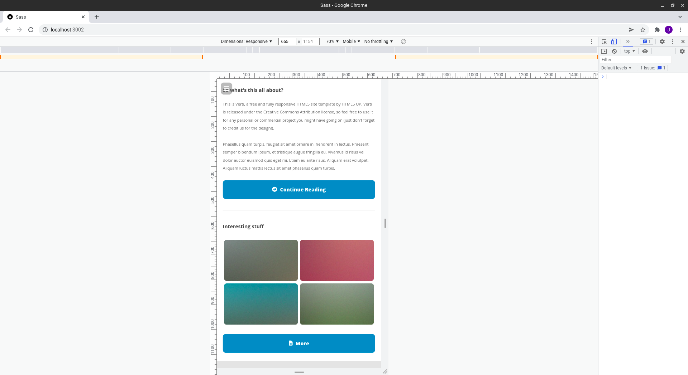

# Verti
> Rewritten HTML5 responsive site template by HTML5 UP available live at https://html5up.net/verti

> Live demo [_here_](https://jacpolanski.github.io/Verti/). <!-- If you have the project hosted somewhere, include the link here. -->

## Table of Contents
* [General Info](#general-information)
* [Technologies Used](#technologies-used)
* [Screenshots](#screenshots)
* [Setup](#setup)
* [Project Status](#project-status)
* [Room for Improvement](#room-for-improvement)
* [Contact](#contact)
<!-- * [License](#license) -->

## General Information
- Project created at CodersLab bootcamp
- Purpose was to learn Mobile First strategy and apply pages responsiveness

## Technologies Used
- HTML
- SCSS

## Screenshots

## Setup
- download or clone repository / `git clone repo_address`
- install dependencies / `npm install`

## Project Status
Project is: _no longer being worked on_. Assumed learning taks completed.

## Room for Improvement
Plenty :)

## Contact
Created by [jac.polanski](www.linkedin.com/in/polanski-jacek) - feel free to contact me!
